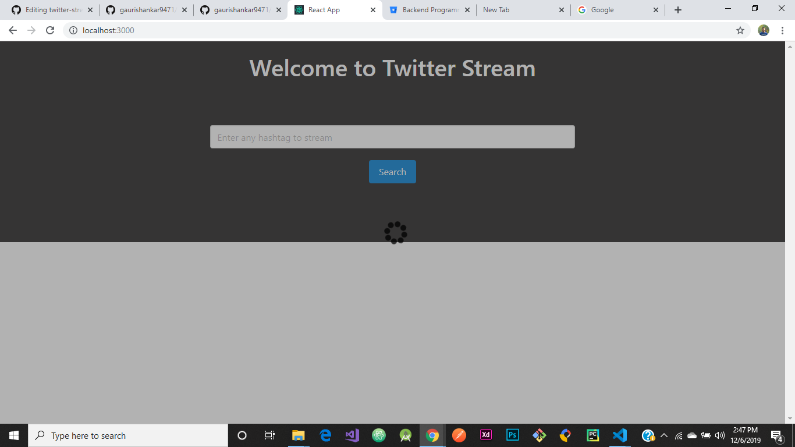
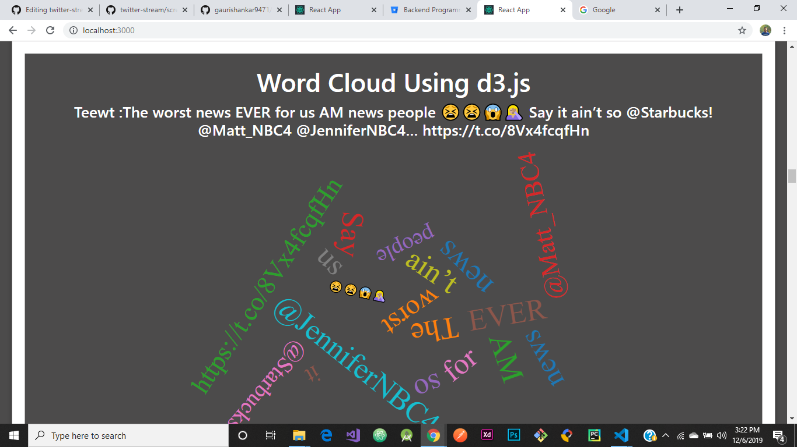

### React and Express Web App for Streaming and Analyzing Sentiments of Tweets
This is simple web application built with React, Express and Socket.io 

This web application can able to stream tweets using Twitter APIs for a given hashtag or a specific twitter account.
This application can also analyze tweet's sentiments for given hashtag or a specific twitter account using NLP(Natural language processing) and you can see the setiment result of tweet and
also there is pie chart available to see sentiment on pie chart.

# Screenshots 
## For Desktop Version

## For Mobile Version

## Screen Recording Video
To watch video please visit on link : [Link](https://drive.google.com/file/d/1sxp5aGVe8v2j-cqef1xnRhRLOFtr87Os/view)

## Available Scripts

In the project directory, you can run:

### `npm start`

To run this web app 
Open [http://localhost:3000](http://localhost:3000) to view it in the browser.

In the server directory under src directory of the project, you can run:

### `node index.js`

To run our server at 3001 Port 

### `npm test`

Launches the test runner in the interactive watch mode. 
